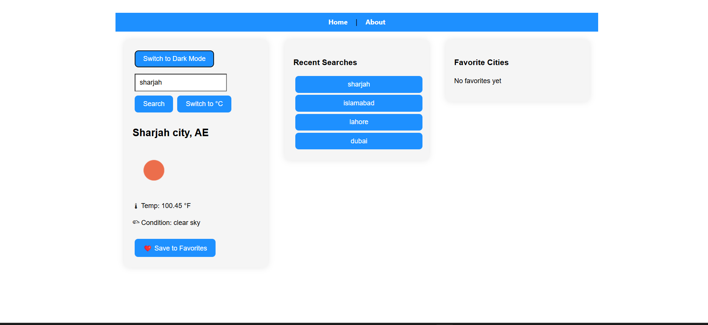

# Weather_App


# 🌦️ Weather App

A responsive and feature-rich weather application built with **React** and **Vite**, integrating the **OpenWeather API** to provide real-time weather data. The application offers a clean UI, intuitive experience, and smart features such as geolocation, unit conversion, search history, dark/light theme support, and favoriting cities.

---

## 🚀 Live Demo

🔗 *https://weather-app-tczn.onrender.com*

---

## 📷 Screenshots



---

## ✨ Features

- 📍 **Current Location Weather** – Auto-fetch weather based on user's location
- 🔍 **City Search** – Enter city name to view real-time weather details
- ♻️ **Search History** – Remembers the last 5 searches (stored in localStorage)
- ❤️ **Favorite Cities** – Save & manage favorite cities for quick access
- 🌡️ **Unit Toggle** – Switch between Celsius (°C) and Fahrenheit (°F)
- 🌓 **Theme Toggle** – Light/Dark mode with saved preferences
- 📱 **Responsive Design** – Optimized for desktop and mobile screens
- 🔐 **Secure API Handling** – API key stored via environment variables

---

## 🛠️ Tech Stack

- **Frontend**: React, Vite
- **Styling**: Custom CSS (Dark/Light theming, Flex layout)
- **API**: [OpenWeatherMap](https://openweathermap.org/)
- **Deployment**: [Render](https://render.com/)
- **Data Persistence**: Browser localStorage
- **State Management**: React Hooks (`useState`, `useEffect`)

---

## 📁 Getting Started

### Clone & Install

```bash
git clone https://github.com/yourusername/weather-app.git
cd weather-app
npm install
```
